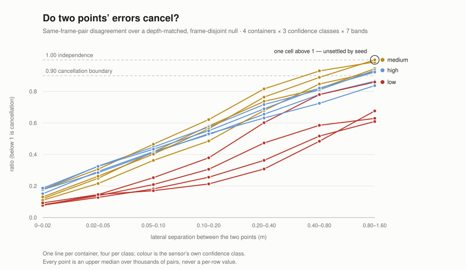

# Skewline

[](https://github.com/sebkoo/Skewline/actions/workflows/ci.yml)

Spatial capture for iOS, where every measurement carries its own confidence.

## The idea

Point a phone at a room and it will tell you where it is, to the centimetre. It
will not tell you how much to trust that centimetre — and those are very
different numbers. A tape measure that is sometimes off by 2 cm and sometimes
off by 30 cm reads exactly the same either way.

The name comes from the geometry. Observe the same point from two positions and
each observation is a ray; in theory the two rays meet at the point. They never
do. Sensor noise, tracking error and timing jitter leave a small gap, and two
lines in space that neither meet nor run parallel are called **skew lines**. The
width of that gap is the measurement's own account of how wrong it might be.
Most pipelines take the midpoint and throw the width away. This one keeps it.

## What the model says

Fitted from four recorded sessions, the model says how far two views of the same
point tend to disagree at a given distance. For two of the depth sensor's three
confidence levels a short formula fitted that disagreement on every trial and was
adopted; for the third, no formula won every trial, so it kept the plain lookup
table it started with — and that table still answers. Outside 0.5 to 5 metres
nothing answers at all, for any level. The refusal is the part worth looking at:
a result that declines to hand you a curve is still a result, and the page the
service renders shows it as plainly as it shows the numbers.


*One class the fit refused, and what refusing looks like. Every candidate lost
at least one fold by a margin the held-out session flips the sign of, which is
the case the adoption bar exists to refuse rather than average away. Read it
from the committed model: `.venv/bin/python Fit/serve.py Fit/model.json`.*

## What is here today

Seven modules, one harness app and the tests that hold them.

- **`Core`** — the measurement records: a pose with the uncertainty beside it
  and the tracker's own trust in that instant, an inertial sample, a camera
  frame, the depth captured with it, the exposure it was captured under and
  the intrinsics it was captured with. No I/O.
- **`Replay`** — the on-disk session format. A recorded session replays
  deterministically, which is what makes the pipeline testable on a laptop with
  no device attached.
- **`Capture`** — the ingest boundary. One consumer written against the protocol
  works unchanged against a recorded session or a live sensor, and there is a
  test that holds it there.
- **`Render`** — a depth pixel becomes a world point through the per-frame
  intrinsics and pose the container already carries — each point born with
  its sensor's confidence, and shaded by it. The accumulated cloud lives in
  one GPU buffer, re-shaded by a compute kernel and drawn to an offscreen
  image, both through one palette that keeps low, medium and high visibly
  distinct. Depends on `Core` and `Replay`, never `Capture`.
- **`Interop`** — a PLY point-cloud file read into Swift values across a
  deliberately C seam. The parsing — three encodings, arbitrary per-element
  property lists — lives in a C++ target behind a pure C header, so no C++
  type crosses a public signature and no importer inherits a language mode.
- **`Model`** — the fitted uncertainty model, read from the endpoint that
  serves it and evaluated locally. A class whose fit was refused still answers,
  from the banded table it kept; outside the depths it was fitted over, nothing
  answers, and those two silences are different cases a caller has to tell
  apart. What it hands back is the disagreement between two readings, not one
  reading's error bar, and it is named that way.
- **`Sight`** — where a sensor reading meets that model: one depth sample and
  the confidence the sensor stamped on it become what the model says about that
  point. The two silences a sensor can produce — a pixel that returned no depth,
  a confidence class the fit never saw — stay apart from the two `Model` already
  tells apart, because they are four different reasons to have no number and a
  caller acts on them differently. The depth it takes is the depth map's own
  sample, the quantity the model was fitted on, and not the length of the ray to
  the point.


*One capture's accumulated cloud, confidence as color. 21.4% of this scene is
less than fully trusted — a map alone would have looked uniformly
authoritative. Reproduce it from any capture:
`swift run -c release RenderProbe <container> --png <dir>`.*

The app is `App/SkewlineHarness`: a start button, a stop button, a panel of
what the run measured, and — while a recording runs — a camera view you can
tap to see what the fitted model says about that one point. It exists to put
the pipeline in front of real sensors and produce containers a Mac can
replay, and it should not grow a second job. **A second job would be a
measuring tool**: two points and the distance between them, a history of
readings, an export of its own. Showing what the model says about a single
point the sensor is looking at now is the same job rather than a new one,
because the model is this pipeline's own output and the frame being tapped is
one the container keeps — the phone shows the frame's index and the point, so
the same tap can be re-derived on a Mac:
`swift run SightProbe <model> <container> --frame N x,y`. That has been done
once, on a device against a laptop, and the two agreed to the digit. A reading
nobody can check would be the second job arriving in disguise.


*A typeset figure, not a screenshot — no pixel of either screen is in it.
Both blocks are verbatim from the run recorded in `docs/DEVLOG.md`.
0.004096 m is not the phone's own number copied over: the high class is
refused a fitted form, so 1.27 m falls to its banded table and lands in
`[1.0, 2.0)`, whose median is 0.004096031 m — already committed in
`Fit/model.json`. Two readers, one artifact, and nothing in this tree
regenerates the figure itself: it was typeset by hand from that same run.*

That refusal has a companion measurement. Two points seen in the same frame
pair share a pose error, and a shared error should largely cancel in their
difference — so the useful question is not what one point's uncertainty is, but
how much of it survives a subtraction. The disagreement of a same-frame-pair
difference is compared against a null in which the second point is replaced by
one matched on class and depth from a frame pair sharing no frame, which forces
independence by construction. Below 1 is cancellation; 1 is what independence
itself would read.

<picture>
  <source media="(prefers-color-scheme: dark)" srcset="docs/media/span-dark.svg">
  
</picture>

*The errors do cancel, and the cancellation weakens as the two points move
apart — monotonically, across all seven bands, in all twelve series, without
exception. One cell of eighty-four sits above 1, and its verdict changes with
the analysis seed, so it is drawn as a question rather than as a finding. This
is still not an interval: what is plotted is a ratio of upper medians against a
permutation null and not a covariance, so it says the errors cancel without
saying what to print after a number. Both files are drawn from the committed
artifacts by
`.venv/bin/python Fit/span_figure.py --artifacts Fit --output-dir docs/media`,
and a test regenerates them and compares byte for byte — editing either one by
hand is a red gate.*

```sh
swift build && swift test
```

Four CI jobs run on every push to `main`. One runs that test suite on macOS.
One builds for iOS — because the sensor path is behind
`#if canImport(ARKit) && os(iOS)`, and code inside a false branch is never
type-checked, so the macOS tests can be green while that file is not even valid
Swift. The third fails when this README contradicts the repository — detection
only, and the fix stays a human commit. The fourth runs the fit harness in
`Fit/` — Python and numpy, because an uncertainty model has to be fitted
somewhere — whose tests plant known model parameters in synthetic data and
require the fit to recover them, or to refuse. That same job covers the
endpoint that serves the fitted model and the page it renders, both beside
the fit and sharing its reader; a service that re-parsed the artifact would
be a second reader to drift, and a page that parsed it in the browser would
be a third.

## Where this goes

Each rung is entered only when the one below it runs.

```text
v0.1  foundation   types · replay · ingest boundary · tests · CI       done
v0.2  capture      ARKit · camera frames · device motion · depth       done
v0.3  render       a point cloud shaded by its own confidence         done
v0.4  measure      frame time, and drift under replay                 done
v0.5  interop      a point-cloud reader over Swift–C++                done
v0.6  fit          the uncertainty model, fitted offline              done
v0.7  service      the fitted model reaches the device                done
v0.8  view         a dashboard over the same service                  done
v0.9  point        what the model says about a point you tap          done
v0.10 span         two points, and whether their errors cancel        done
```

Rungs are planned; individual commits are not. What each commit contains is
decided by what the one before it turned out to be wrong about — which is why
[`docs/DEVLOG.md`](docs/DEVLOG.md) records the mistakes alongside the decisions.
[`docs/ROADMAP.md`](docs/ROADMAP.md) says what forces each rung, and what is
deliberately never built.

## What is not here

There is no interactive viewer — `Render` draws the cloud to an offscreen
image, never to a window — and no reconstruction. Rates, budgets and payload
sizes are measured and recorded in [`docs/DEVLOG.md`](docs/DEVLOG.md), and so,
now, is a first measured error scale: the confidence classes are calibrated
against observed cross-frame disagreement, high 3.1–10.8 mm and low
18.9–197.2 mm depending on depth band, ordering held in 16 of 16 comparisons
with margin. **What is still not here is pose error against ground truth** —
there is no truth rig, and cross-frame reprojection measures the joint
pose-and-depth disagreement a replay can observe, not pose accuracy on its
own. A number that has not been measured is worse than no number.

Nothing is deployed. The fitted model is served by a local endpoint, not by a
host somebody operates, and no secret or hostname is in this repository. It
binds loopback unless its operator names an interface, which takes an explicit
argument and prints a warning on every run — a phone cannot reach a loopback
socket on a laptop, and that is the only reason the flag exists. What it widens
is reach and not exposure: there is no authentication because nothing served is
private, and anyone who can reach the machine reads the same artifact this
repository already publishes. The wire runs one way: what it carries down is
the same aggregate artifact already committed here, and nothing from a capture
goes up — no frames, no depth, no observation rows, and no per-point query,
since asking "how wrong is a reading at this depth" would send the asker's own
depths to whoever runs the service. The Swift client evaluates the model
itself, and that client exists.

**No observation export is committed**, and that sentence is checked rather
than promised. The files the fit and the span analysis read are derived from
home captures: the newer of the two carries a frame index and a pixel per row,
so grouped by frame it is a subsampled depth image of a room. They stay on the
machine that made them, and only aggregates — the fitted model, and the span
artifact beside it — ever enter this repository. The drift check walks the tree
and fails on any file whose first line is an observation schema tag, so
committing one is a red gate rather than a matter of remembering.

The same service also renders a page describing the model, and that page is
the first consumer here that does not read the artifact for itself: a browser
cannot import the fit, so one that parsed the schema would be a third
implementation of it, after the Python that writes it and the Swift that
reads it. What survives is not a count of endpoints but the exclusion itself
— **no depth a client picked ever travels up.** Every depth on that page is
the repository's own, fixed in the tree, and no parameter exists that could
carry a viewer's instead. It is also why the page offers no depth slider:
making it interactive needs either a script in the browser or a query
parameter, and the second is the per-point query this paragraph refuses.

Reconstruction is deliberately out of scope. This is the layer underneath it:
any reconstruction is only as trustworthy as its input, and today that input
arrives with no confidence attached.

## Licence

See [`LICENSE`](LICENSE).
